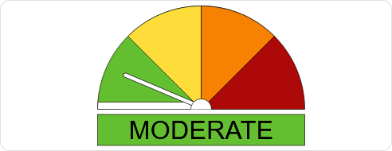

# Australian Fire Risk Indicator Card

A very basic fire indication card that uses data from the [BOM Integration](https://github.com/bremor/bureau_of_meteorology) and displays it following [AFAC's guidelines](https://www.afac.com.au/docs/default-source/afdrs/afdrs-signage_update-style_guide.pdf) (mostly).



## Installation

### Install through HACS

1. Navigate to HACS -> Front-end -> Overflow menu -> Custom Repositories.
2. Insert the repository URL (`https://github.com/yetanothercarbot/au-fire-risk-card`) and select type as 'Lovelace'
3. Install as normal through HACS.

### Manual install

1. Download au-fire-risk-card.js from [Releases](https://github.com/yetanothercarbot/au-fire-risk-card/releases/).
2. Upload to `/www/au-fire-card-risk/au-fire-risk-card.js`.
3. Open the [Resources](https://my.home-assistant.io/redirect/lovelace_resources/) (Settings -> Dashboards -> Overflow Menu -> Resources) and add `/local/au-fire-risk/au-fire-risk-card.js`.
4. Refresh browser.

## Setup

You will need to have the [BOM Integration](https://github.com/bremor/bureau_of_meteorology) configured. The Fire Danger sensor it creates needs to be enabled in the Forecast Sensors step of its configuration.

The configuration only has a single, required setting - `entity` is the Entity ID for the Fire Danger sensor. 

An example setup, which shows the fire risk for Sawyers Valley:

```
type: custom:au-fire-risk-card
entity: sensor.sawyers_valley_fire_danger_0
```